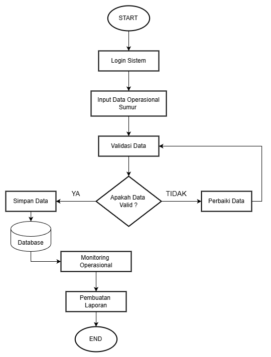

# Alur Kerja Sistem 
1. Admin Operasional melakukan input data operasional sumur melalui sistem.
2. Sistem melakukan validasi terhadap data yang dimasukkan, seperti kelengkapan dan format data.
3. Jika data tidak valid atau tidak lengkap, sistem akan menampilkan pesan kesalahan dan meminta
   pengguna untuk melakukan perbaikan.
4. Jika data valid, sistem akan menyimpan data ke dalam database secara terpusat.
5. Data yang telah tersimpan dapat diakses oleh Admin Operasional dan Kepala Bagian untuk keperluan monitoring.
6. Sistem mengolah data yang tersedia untuk menghasilkan laporan operasional.
7. Laporan yang dihasilkan digunakan sebagai dasar dalam pengambilan keputusan operasional.

## Flowchart Sistem

Flowchart ini menggambarkan alur sistem operasional kontrol sumur mulai dari proses input data oleh pengguna hingga menghasilkan laporan operasional.

Data yang dimasukkan akan melalui tahap validasi untuk memastikan kelengkapan dan konsistensi. Jika data tidak valid, pengguna akan melakukan perbaikan sebelum disimpan ke dalam database.

Data yang telah tersimpan kemudian digunakan untuk monitoring operasional dan pembuatan laporan sebagai dasar evaluasi dan pengambilan keputusan.
