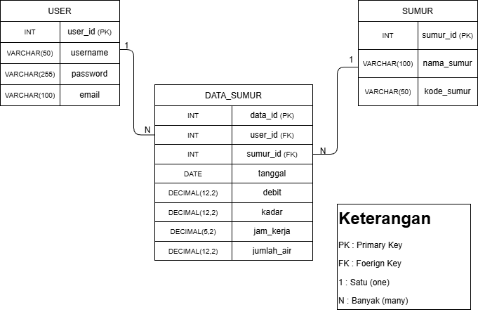

# Struktur Data 

## 1. Pengguna 
   Entitas ini digunakan untuk menyimpan data pengguna yang memiliki akses ke sistem.
   
   **Atribut:**
   * id
   * username
   * password
   * email

## 2. Sumur 
   Entitas ini berisi data referensi jenis - jenis sumur yang digunakan dalam operasional.
   
   **Atribut:**
   * id
   * name
   * kode

## 3. Data Operasional Sumur 
   Entitas ini berisi data utama yang menyimpan hasil operasional sumur setiap periode 
   
   **Atribut:**
   * id
   * master_bagan (relasi ke master sumur)
   * kode
   * type
   * date
   * debit
   * kadar
   * jam kerja
   * jumlah air

## Relasi Antar Entitas
   * Setiap data operasional sumur terhubung dengan satu jenis sumur pada tabel master sumur
   * Satu user dapat mengelola banyak data operasional sumur

## ERD Sistem

ERD ini menggambarkan struktur database sistem operasional kontrol sumur yang terdiri dari tiga entitas utama yaitu User, Sumur, dan Data Operasional Sumur.

Relasi yang digunakan adalah one-to-many (1:N), dimana satu pengguna dapat menginput banyak data operasional, dan satu sumur dapat memiliki banyak data operasional.

Tabel Data Operasional Sumur berperan sebagai tabel transaksi, sedangkan tabel User dan Sumur berfungsi sebagai tabel referensi untuk menjaga konsistensi data.

